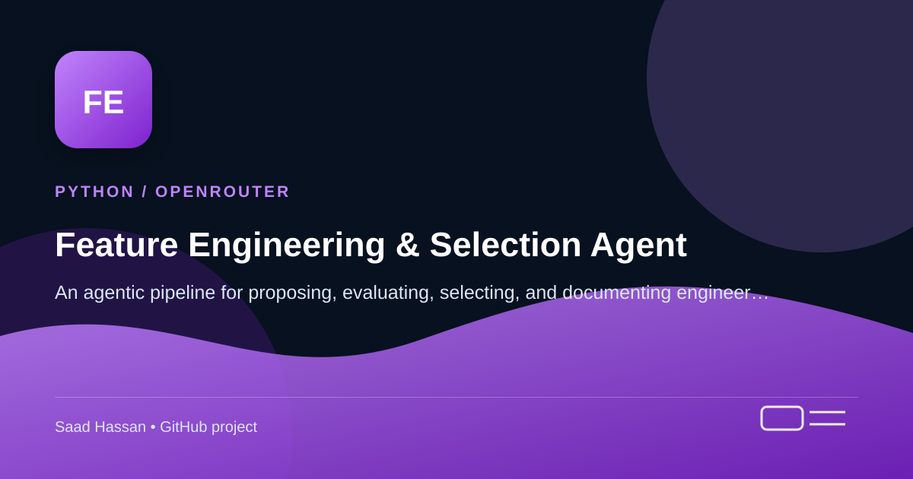

<!-- Project cover -->
<p align="center">
  
</p>

> **Python / OpenRouter** — An agentic pipeline for proposing, evaluating, selecting, and documenting engineered features.

## Project snapshot

- Uses safe feature materialization and leakage-aware cross-validation to measure real lift.
- Includes a root-level <a href="./project-cover.svg">project-cover.svg</a>, a scalable project cover graphic for this repository.

---

# Feature Engineering & Selection Agent

An **agentic** feature-engineering pipeline that does what a principal data
scientist does before modeling: brainstorm candidate features, write the code,
evaluate each against a baseline, prune the ones that don't contribute, audit for
leakage, and document what survived and why — then hand back a reproducible
pipeline and a report.

It is powered by **OpenRouter** (any JSON-capable model) and built on one core
principle:

> **The LLM proposes; deterministic statistics decide.**
> An LLM proposes candidate feature *specifications* (never raw code). A safe
> executor materializes them, a leakage-safe cross-validation harness measures each
> candidate's *marginal lift over the baseline*, and statistically principled gates
> prune. The LLM only adjudicates genuinely borderline cases — and even then it
> cannot keep a feature without evidence.

## Why this over a naive "ask the LLM for features" script

The prototype this replaces had six fatal defects; each drove a design decision:

| Prototype defect | This agent |
|---|---|
| Hardcoded OpenAI + `gpt-4o-mini` | OpenRouter client wrapper, model in config, cost ceiling |
| `df.eval()` on raw LLM formula strings | **Two-tier safe executor**: declarative ops + AST-whitelisted expressions |
| In-sample importance among candidates only | **Baseline-vs-augmented CV** measuring marginal lift, OOF permutation importance |
| Fixed importance threshold | **Shadow (noise) feature gate** — a data-adaptive null distribution (Boruta idea) |
| No leakage defense | **Three layers**: static validator, fold-fitted transforms, empirical flagging |
| `fillna(0)`, classification-only | Typed preprocessing, native NaN/categorical handling, **regression + classification** |

## How it works

```
             deterministic (exact, reproducible)                         LLM (judgment)
 data ─► profile ─► GENERATE specs ─► VALIDATE+MATERIALIZE ─► EVALUATE (CV) ─► SELECT ─► REPORT
          (or        (op vocab,        (static leakage guard,   baseline Δ,     shadow    (registry,
          eda_agent   grounded in       AST whitelist,          OOF perm.       gate,     pipeline,
          artifact)   the profile)      safe executor)          importance,     redundancy, report.md)
                          ▲             shadow features         adjudicate
                          └──────── feedback: survivors, prunes, rejections → next round (≤ R) ─────┘
```

1. **Profile** — column types, cardinality, missingness, target-association sketch.
   Ingests an `eda_agent` `report.json` if one is supplied (falls back to internal profiling).
2. **Generate** — the LLM proposes `FeatureSpec`s from a fixed op vocabulary
   (`ratio`, `group_stat`, `date_part`, `freq_encode`, …) or row-wise expressions.
   Schema-validated, deduplicated against prior rounds.
3. **Validate + materialize** — static leakage checks, then execution through a
   safe executor. Invalid candidates are rejected with a machine-readable reason
   that feeds back to the generator.
4. **Evaluate** — paired baseline vs augmented K-fold CV (Stratified / Group-aware).
   Per-candidate attribution via out-of-fold permutation importance. Shadow noise
   features injected as a significance benchmark.
5. **Select + adjudicate** — deterministic gates (shadow gate, redundancy
   clustering, fold stability) first; the LLM reviews an *evidence pack* for
   borderline candidates only and may prune or request a segment-restricted test —
   never keep by assertion.
6. **Report** — a feature registry (every candidate ever tried), a serialized
   sklearn pipeline, and a written `report.md`.

## Install

```bash
git clone https://github.com/<your-org>/feature-agent.git
cd feature-agent

pip install -e .                       # or: pip install -e ".[lightgbm,parquet,dev]"
# LightGBM is recommended (native NaN + categorical handling); without it the
# harness falls back to scikit-learn's HistGradientBoosting.

cp .env.example .env                   # add your OPENROUTER_API_KEY
```

## Quick start

```bash
# Reference churn scenario with planted signal + a leak column (great first run)
feature-agent --demo

# Your data, supervised
feature-agent data.csv --target churned --task classification \
    --forbidden cancellation_date --group-column customer_id \
    --domain "B2B SaaS; churn = no renewal within 30 days"

# No API key / offline — deterministic generator + report, no LLM
feature-agent data.csv --target price --task regression --no-llm
```

Outputs land in `feature_runs/<run_id>/`: `report.md`, `feature_registry.json`,
`pipeline.joblib`, `manifest.json`, and `rounds/round_<k>.json`.

### As a library

```python
import pandas as pd
from feature_agent import FeatureAgent, FeatureAgentConfig

df = pd.read_csv("data.csv")
result = FeatureAgent(FeatureAgentConfig.from_env()).run(
    df, target="churned", task="classification",
    domain_context="B2B SaaS subscription business; churn = no renewal within 30 days",
)
result.kept_features      # list[CandidateResult] with scores + rationale
result.pipeline           # sklearn Pipeline: raw df -> engineered matrix
result.report_path        # report.md
result.pipeline.transform(df)   # reproduce the engineered features on any frame
```

## Leakage defense (the highest-severity failure mode)

A leaky feature looks *spectacular* in evaluation and poisons the model. Defense
in depth:

1. **Static** — reject any reference to the target or user-declared post-outcome
   columns (`forbidden_columns`), unknown inputs, and fitted group ops keyed on a
   near-unique column (row identity).
2. **Structural** — fitted transforms (`group_stat`, `count_encode`, `bin_quantile`,
   `target_encode`) are refit *inside each CV fold on training rows only*. Row-wise
   ops and expressions are stateless and safe by construction.
3. **Empirical** — a candidate that predicts the target almost alone
   (single-feature AUC / |Spearman| near 1) is **flagged, never kept**, and
   surfaced for human review.

The safe executor never runs LLM code: declarative ops come from a fixed library,
and the expression escape hatch is AST-whitelisted (no attribute access,
subscripts, imports, dunders, or non-numpy calls) and row-wise only.

## Configuration

Everything is on `FeatureAgentConfig` (`feature_agent/config.py`) — thresholds,
budgets, and the CV protocol are documented there. Common knobs:

| Field / env | Default | Meaning |
|---|---|---|
| `OPENROUTER_API_KEY` | — | required for LLM runs |
| `OPENROUTER_MODEL` / `model` | `anthropic/claude-sonnet-4` | any JSON-capable model |
| `fallback_model` | — | cheaper model for the report stage |
| `max_cost_usd` | `2.00` | hard per-run cost ceiling |
| `n_candidates_per_round` / `max_rounds` | `15` / `3` | generation budget |
| `n_folds` | `5` | CV folds |
| `cv_metric` | `auto` | `auc` / `average_precision` / `rmse` / `mae` |
| `group_column` | — | entity id → GroupKFold (no customer straddles folds) |
| `forbidden_columns` | `[]` | post-outcome / leaky columns |
| `shadow_percentile` | `95` | a candidate must beat this shadow percentile |
| `redundancy_rho` | `0.90` | \|Spearman\| clustering threshold |
| `min_lift` | `0.5*std` | confirmation-ablation requirement |
| `enable_target_encode` | `False` | fold-fitted target encoding (opt-in) |

## Outputs & reproducibility

```
feature_runs/<run_id>/
├── manifest.json          # dataset hash, config, model, prompt hashes, seeds,
│                          #   package versions, cost, wall time
├── feature_registry.json  # every candidate ever proposed: spec, status, scores,
│                          #   decision rationale, round index
├── pipeline.joblib        # sklearn Pipeline: raw df -> engineered matrix (kept only)
├── report.md              # narrative: what was tried, what survived and why, flags
└── rounds/round_<k>.json  # per-round summary
```

The registry records *pruned and rejected* candidates too — "we tried
`tickets_per_spend_ratio` and it failed the shadow gate" is the documentation the
manual process never produces, and it stops the next run from re-proposing dead ends.

## What it deliberately does **not** do (v1)

Deep-learning feature learning, time-series lags/windows, automated target
transformation, multi-table synthesis, and downstream hyperparameter tuning. See
§13 of the design doc.

## Tests

```bash
python -m pytest tests/
```

The suite runs fully offline (the LLM is stubbed): an adversarial executor suite,
leakage canaries, the recovery benchmark (planted signal beats the shadow gate,
noise fails), determinism, and a stubbed-LLM end-to-end run.

## Project layout

```
feature-agent/
├── feature_agent/
│   ├── config.py          # FeatureAgentConfig (thresholds, budgets, CV protocol)
│   ├── schemas.py         # Pydantic data contracts (FeatureSpec, CandidateResult, …)
│   ├── llm.py             # OpenRouter client: retries, JSON→Pydantic, cost accounting
│   ├── profile.py         # profiling + eda_agent artifact ingestion
│   ├── ops.py             # declarative op library (fold-safe transformers)
│   ├── executor.py        # AST whitelist + FeatureMaterializer
│   ├── guards.py          # leakage validator + empirical suspicion heuristics
│   ├── generate.py        # LLM + deterministic candidate generation, dedup
│   ├── evaluate.py        # paired CV, OOF permutation importance, shadows
│   ├── select.py          # gates, redundancy, stability, LLM adjudication
│   ├── report.py          # registry, pipeline export, report.md
│   ├── orchestrator.py    # round loop, budgets, manifest, public API
│   ├── prompts/           # generate / adjudicate / report templates
│   ├── sample_data.py     # synthetic churn + planted-signal datasets
│   └── cli.py             # `feature-agent` entry point
├── tests/
├── Agent 2.md             # the design doc this implements
├── pyproject.toml
└── requirements.txt
```
